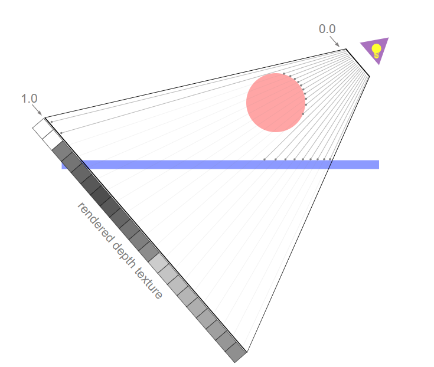
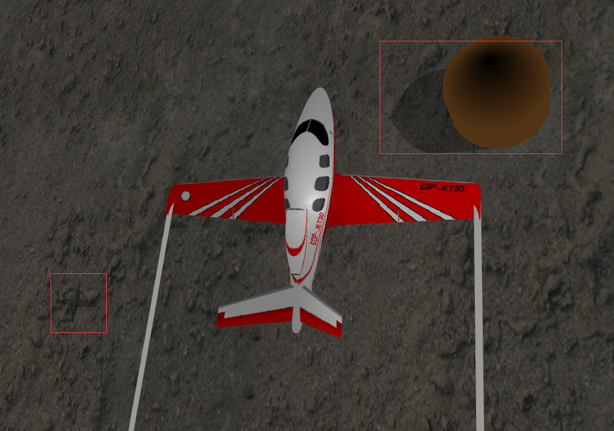

## 实时阴影实现

实时阴影的原理实际为纹理贴图，本程序中我们通过实时绘制一张“影子”的纹理，并将其贴图在地板上，以达到实时阴影的效果。

### 纹理贴图

在物体被渲染时，对于每一个像素，检查被投影的纹理是否在范围内，如果在范围内，就从被投影的纹理中采样相应的颜色，如果不在范围内，就从自身的颜色或从其他的纹理中采样颜色。纹理的颜色是通过使用纹理坐标进行查找的，纹理坐标把一个纹理映射到了物体上。

```js
const vsSource=`
	attribute vec4 a_position;
	attribute vec2 a_texcoord;
 
	uniform mat4 u_matrix;
 
	varying vec2 v_texcoord;
 
	void main() {
  	// 将位置和矩阵相乘
  	gl_Position = u_matrix * a_position;
  	// 传递纹理坐标到片断着色器
  	v_texcoord = a_texcoord;
	}
`;
const fsSource=`
	precision mediump float;
 
	// 从顶点着色器中传入的值
	varying vec2 v_texcoord;
 
	// 纹理
	uniform sampler2D u_texture;
 
	void main() {
   		gl_FragColor = texture2D(u_texture, v_texcoord);
	}
`;
```

### 渲染到纹理

创建一个纹理贴图，再创建一个新的帧缓冲区，并和这个纹理绑定，此后每次调用 `gl.clear`, `gl.drawArrays`, 或 `gl.drawElements`时，WebGL都会渲染到纹理上而不是画布上。

```js
function initFramebufferObject(gl) {
    var framebuffer, texture, depthBuffer;
    // Create a framebuffer object (FBO)
    framebuffer = gl.createFramebuffer();
    // Create a texture object and set its size and parameters
    texture = gl.createTexture(); // Create a texture object
    gl.bindTexture(gl.TEXTURE_2D, texture);
    gl.texImage2D(gl.TEXTURE_2D, 0, gl.RGBA, OFFSCREEN_WIDTH, OFFSCREEN_HEIGHT, 0, gl.RGBA, gl.UNSIGNED_BYTE, null);
    gl.texParameteri(gl.TEXTURE_2D, gl.TEXTURE_MIN_FILTER, gl.LINEAR);
    gl.texParameteri(gl.TEXTURE_2D, gl.TEXTURE_WRAP_S, gl.CLAMP_TO_EDGE);
    gl.texParameteri(gl.TEXTURE_2D, gl.TEXTURE_WRAP_T, gl.CLAMP_TO_EDGE);
    // Create a renderbuffer object and Set its size and parameters
    depthBuffer = gl.createRenderbuffer(); // Create a renderbuffer object
    gl.bindRenderbuffer(gl.RENDERBUFFER, depthBuffer);
    gl.renderbufferStorage(gl.RENDERBUFFER, gl.DEPTH_COMPONENT16, OFFSCREEN_WIDTH, OFFSCREEN_HEIGHT);
    gl.bindFramebuffer(gl.FRAMEBUFFER, framebuffer);
    gl.framebufferTexture2D(gl.FRAMEBUFFER, gl.COLOR_ATTACHMENT0, gl.TEXTURE_2D, texture, 0);
    gl.framebufferRenderbuffer(gl.FRAMEBUFFER, gl.DEPTH_ATTACHMENT, gl.RENDERBUFFER, depthBuffer);
    framebuffer.texture = texture; // keep the required object
    // Unbind the buffer object
    gl.bindFramebuffer(gl.FRAMEBUFFER, null);
    gl.bindTexture(gl.TEXTURE_2D, null);
    gl.bindRenderbuffer(gl.RENDERBUFFER, null);
    return framebuffer;
}
```

因此，只需要将物体的影子当作普通的绘制一样，绘制在纹理上，即可以在后续的绘制中将影子纹理贴在地板表面了。

```js
var fbo = initFramebufferObject(Program.gl);
Program.gl.bindFramebuffer(Program.gl.FRAMEBUFFER, fbo);// Change the drawing destination to FBO
Program.gl.viewport(0, 0, OFFSCREEN_HEIGHT, OFFSCREEN_HEIGHT);// Set view port for FBO
Program.gl.clear(Program.gl.COLOR_BUFFER_BIT | Program.gl.DEPTH_BUFFER_BIT);// Clear FBO  
drawShadow(Program, objbuffers[0], aircraft_modelMatrix, viewMatrixFromLight, projectionMatrixFromLight);
...//call drawShadow() to draw shadows onto the shadow texture
```

当影子绘制完成后，还需要将绘制区域切换成正常的画布

```js
Program.gl.bindFramebuffer(Program.gl.FRAMEBUFFER, null);               // Change the drawing destination to color buffer
Program.gl.viewport(0, 0, cw, ch);
Program.gl.clear(Program.gl.COLOR_BUFFER_BIT | Program.gl.DEPTH_BUFFER_BIT);    // Clear color and depth buffer
```

### 制作阴影纹理

制作阴影纹理的原理是制作一张包含了来自光源视角的深度数据




上图的结果是，球体会得到一个更加接近光源的深度值，而平面会得到一个稍微远离光源的深度值。获得深度信息后，在选择渲染哪个颜色时，就可以从被投影的纹理中进行采样，得到一个采样深度值，然后和当前正在绘制的像素的深度值进行比较。如果当前像素的深度值比采样得到的深度值大，则说明还有其他东西比当前像素更加接近光源。也就是说，某样东西挡住了光源，则该像素是处于阴影中的。

#### 选择光源位置

游戏模拟了太阳的光线，即平行光，但阴影投影时，需要一个与光线方向对应的“点光源”作为视锥的光点，以此绘制阴影贴图。因此，选择光线方向延伸一定距离的位置作为点光源，并设置来自光点的视角矩阵，可以在保持光线方向不变的情况下，模拟视锥的效果，具体代码如下。

```js
var LIGHT_X = -lightDirection[0] * light_Scale, LIGHT_Y = -lightDirection[1] * light_Scale, LIGHT_Z = -lightDirection[2] * light_Scale;
//设置光看的投影矩阵  
function setProjectionMatrixFromLight(gl) {
    const fieldOfView = 75 * Math.PI / 180;   // in radians
    const aspect = OFFSCREEN_WIDTH / OFFSCREEN_HEIGHT;
    const zNear = 0.1;
    const zFar = 1000.0;
    const projectionMatrix = mat4.create();
    mat4.perspective(projectionMatrix,
        fieldOfView,
        aspect,
        zNear,
        zFar);
    return projectionMatrix;
}
//设置光看的视角矩阵，根据视点，目标点和上方向确定视角矩阵
function setViewMatrixFromLight(LIGHT_X, LIGHT_Y, LIGHT_Z) {
    //设置view坐标系
    var light_eye = [LIGHT_X, LIGHT_Y, LIGHT_Z];
    var light_target = [0.0, 0.0, 0.0];
    const ViewMatrix = mat4.create();
    // mat4.lookAt(ViewMatrix, light_eye, light_target, up);   
    mat4.lookAt(ViewMatrix, light_eye, target, up);
    return ViewMatrix;
}
```

#### 将深度写入阴影纹理

因此，需要从光源视角绘制一次物体，并将深度值写入阴影纹理中

```js
const shadow_vsSource = `
attribute vec4 aVertexPosition;

uniform mat4 uProjectionMatrix;  //投影矩阵，用于定位投影
uniform mat4 uViewMatrix;  //视角矩阵，用于定位观察位置
uniform mat4 uModelMatrix;  //模型矩阵，用于定位模型位置

void main() {
  gl_Position = uProjectionMatrix * uViewMatrix * uModelMatrix * aVertexPosition;
}
`;
const shadow_fsSource = `
precision mediump float;

void main() {
    const vec4 bitShift = vec4(1.0, 256.0, 256.0 * 256.0, 256.0 * 256.0 * 256.0);
    const vec4 bitMask = vec4(1.0/256.0, 1.0/256.0, 1.0/256.0, 0.0);
    vec4 rgbaDepth = fract(gl_FragCoord.z * bitShift);
    rgbaDepth -= rgbaDepth.gbaa * bitMask;
    gl_FragColor = rgbaDepth;
}
`;
```

### 将阴影纹理贴图到地板上

对于地板，共使用了两张纹理贴图，一张为地板的材质，使用3号采样器，一张为影子贴图，使用7号采样器

先根据地板的纹理坐标对地板的材质进行采样，并将纹理的颜色设为地板的颜色。然后根据地板的像素深度与影子贴图中存储的像素深度比较，若地板的像素深度更深，则地板处于阴影之中，将原先的地板颜色rgb统一乘以0.7，得到影子的效果

```js
const plane_vsSource = `
    attribute vec4 a_Position;
    attribute vec4 aNormal; //法向量
    attribute vec2 aTextCoord; //纹理

    uniform mat4 uModelMatrix;  //模型矩阵，用于定位模型位置
    uniform mat4 uProjectionMatrixFromLight;//光源角度的投影矩阵
    uniform mat4 uViewMatrixFromLight;//光源角度的视角矩阵
    uniform mat4 uProjectionMatrix;  //投影矩阵，用于定位投影
    uniform mat4 uViewMatrix;  //视角矩阵，用于定位观察位置
    uniform mat4 uReverseModelMatrix; //模型矩阵的逆转置

    varying vec4 v_PositionFromLight;
    varying vec3 v_Normal;
    varying vec4 v_Position;
    varying vec2 v_TextCoord;

    void main() {
        gl_Position =  uProjectionMatrix * uViewMatrix * uModelMatrix * a_Position; 
        v_Normal = normalize(vec3(uReverseModelMatrix * aNormal));
        v_Position = uModelMatrix * a_Position;
        v_TextCoord = aTextCoord;
        v_PositionFromLight =uProjectionMatrixFromLight * uViewMatrixFromLight * uModelMatrix * a_Position;
    }
    `;
const plane_fsSource = `
    precision mediump float;

    uniform sampler2D uShadowMap;
    uniform sampler2D uSampler;

    uniform vec3 uLightColor; //光颜色强度
    uniform vec3 uLightDirection; //光线方向
    uniform vec3 uAmbientLight; // 环境光
    uniform float plane_height; //飞机高度

    varying vec4 v_PositionFromLight;
    varying vec3 v_Normal;
    varying vec4 v_Position;
    varying vec2 v_TextCoord;

    float unpackDepth(const in vec4 rgbaDepth) {
        const vec4 bitShift = vec4(1.0, 1.0/256.0, 1.0/(256.0 * 256.0), 1.0/(256.0 * 256.0 * 256.0));
        float depth = dot(rgbaDepth, bitShift);
        return depth;
    }

    void main() {
        vec4 v_Color=texture2D(uSampler,v_TextCoord);
        vec3 lightDirection = normalize(uLightDirection);
        //计算cos入射角 当角度大于90 说明光照在背面 赋值为0
        float nDotLight = max(dot(lightDirection, v_Normal), 0.0);
        //计算漫反射光颜色
        vec3 diffuse = uLightColor * v_Color.rgb * nDotLight;
        // 环境反射光颜色
        vec3 ambient = uAmbientLight * v_Color.rgb;
        vec4 tmp_Color = vec4(diffuse + ambient, v_Color.a);

        vec3 shadowCoord = (v_PositionFromLight.xyz/v_PositionFromLight.w)/2.0 + 0.5;
        vec4 rgbaDepth = texture2D(uShadowMap, shadowCoord.xy);
        float depth = unpackDepth(rgbaDepth);
        float visibility =(shadowCoord.z > depth + 0.0015)? 0.7:1.0;
        // gl_FragColor = vec4(tmp_Color.rgb * visibility, 1.0-plane_height/50.0);
        gl_FragColor = vec4(tmp_Color.rgb * visibility, 1.0);

    }
    `;
```

以下为实时阴影效果图


